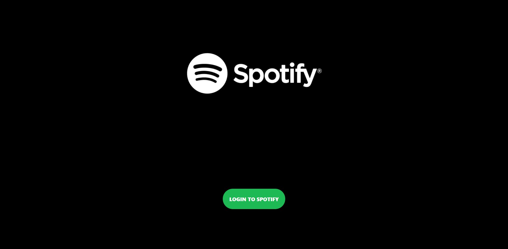
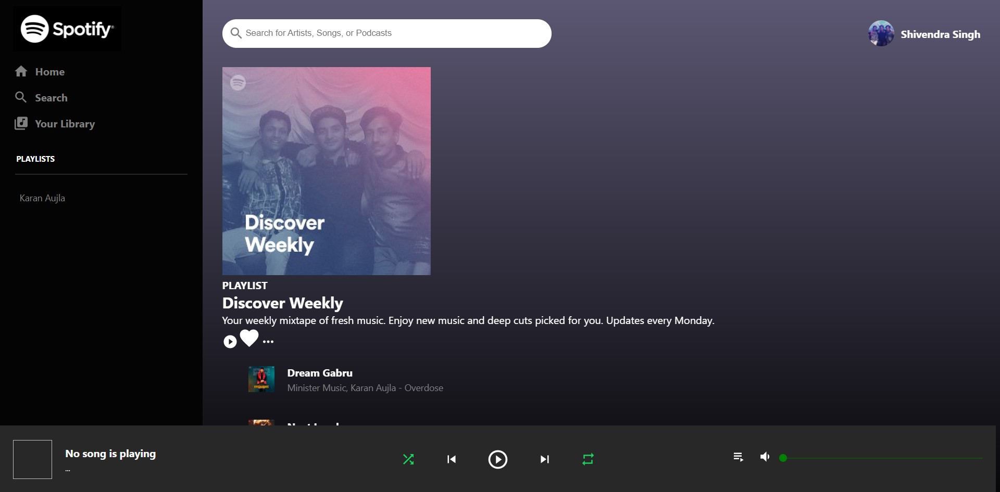

# Spotify Clone

This project is a clone of the Spotify website. You may visit the site through the link https://spotify-clone-012.netlify.app

# Project Screenshots

# Login Page

 

# Home Page

 

# Note For Developers

### Technologies Used:

1. React JS
2. Material UI for icons
3. Spotify API for authentication and user data fetching
4. Netlify for deployment

Icons from Material UI library have been used. Link is https://material-ui.com/components/material-icons

Spotify Web API has been used for User authentication and to fetch the playlists data of the user. The link for their library is https://developer.spotify.com/documentation/web-api/reference

You can run the below commands to see the project on your local system.

 

# Steps to run this project on your local machine:

Disclaimer: Use the package manager you have on your system. Run either: npm or yarn.

### Step - 1

Download the zip file from the above "Code" option, \
 or, \
Clone this repository by running the command "git clone https://github.com/shivendradb/Spotify-clone.git" on the command prompt on your machine. \
Now, open the project directory using "cd Spotify-clone" command.

### Step - 2

In the project directory, run the command "npm install" on the command prompt to install the dependencies of the project on your local machine.

### Step - 3

Run the project on the localhost by running "npm start" on the command prompt.

Great!! 😃 You are done with the setup part. 🚀

Now, open http://localhost:3000 to view it in your browser.

 

Note: \
The page will reload if you make edits.\
You will also see any lint errors in the console.
